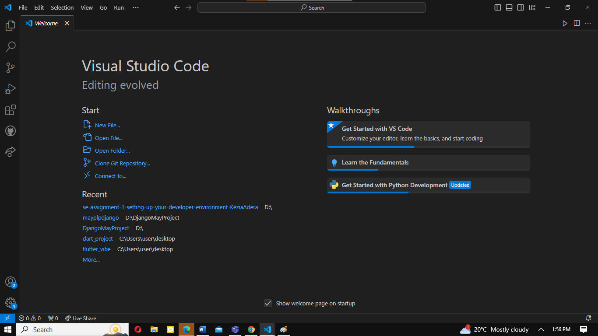

# Dev_Setup
Setup Development Environment

#Assignment: Setting Up Your Developer Environment

#Objective:
This assignment aims to familiarize you with the tools and configurations necessary to set up an efficient developer environment for software engineering projects. Completing this assignment will give you the skills required to set up a robust and productive workspace conducive to coding, debugging, version control, and collaboration.

#Tasks:

1. Select Your Operating System (OS):
   Choose an operating system that best suits your preferences and project requirements. Download and Install Windows 11. https://www.microsoft.com/software-download/windows11
Go to the Windows 11 Downloads page and click the Download Now button under Windows 11 Installation Assistant
Run the just-downloaded Windows 11 Installation Assistant executable file
Click Accept and Install on the terms of agreement window.
Windows 11 will automatically start downloading. Give the installation some time to complete.
Your PC will restart 30 minutes after downloading is complete to install Windows 11 or you can select Restart now to begin immediately.

2. Install a Text Editor or Integrated Development Environment (IDE):
   Select and install a text editor or IDE suitable for your programming languages and workflow. Download and Install Visual Studio Code. https://code.visualstudio.com/Download
Installation: Download and install Visual Studio Code from the official website
(https://code.visualstudio.com/). using yourweb browser.
Step 1: Click on the "Download for Windows" button to download the installer file.
Step 2: when the download is complete, locate the downloaded installer file (usually in your
Downloads folder) and double-click on it to run it.
Step 3: Follow the prompts in the installation wizard, choose the installation
location and whether to add VS Code to your PATH (environment variables) during the installation
process.
Step 4:  After the installation is complete, you can launch Visual Studio Code by
double-clicking its shortcut icon on the desktop or by searching for "Visual Studio Code" in the Start
menu.Visual studio is used among developers due to its versatility, performance, and
extensibility. Whether you're a beginner or an experienced programmer, VS Code can be tailored to
meet your coding requirements and preferences.

3. Set Up Version Control System:
   Install Git and configure it on your local machine. Create a GitHub account for hosting your repositories. Step 1: Initialize a Git repository for your project and make your first commit. https://github.com
Navigate on the official website and download the latest git .
   Step 2: Follow the prompts upto installation.
   after installation of git and git bash,
   Step 3: create a github account, enter your personal details, that includes your username and email address that will be linked to your account, youll have to create a strong password.
   Step 4:  start the verification process through puzzles
   click on the green button (continue to proceed and accept the terms and conditions)
   enter the verification code sent to your email and proceed.
   Step 5: choose the plan prefered to be the free plan

   To initialize a git repository for your project,
   Step 1: Open Git bash,
   Step 2: navigate to the root of your directory,
   step 3:initialize the local directory by inputing the command, git init -b main, then click enter
   Step 4: To make your first commit, enter the command git add . then click enter
   git commit -m "write your intended message"
   Step 5: Click enter
   The file will be saved on your github repository

4. Install Necessary Programming Languages and Runtimes:
  Instal Python from http://wwww.python.org programming language required for your project and install their respective compilers, interpreters, or runtimes. Ensure you have the necessary tools to build and execute your code.
Download the latest release of python
step 1: select the python version to download
Step 2 click on the install now double click the executable file that has been downloaded
select customized installation and proceed
click on the add path check box and the python path is set
choose your most prefered location

5. Install Package Managers:
   If applicable, install package managers like pip (Python).
visit the link https://ww.python.org/downloads/
PIP is a package management system written on python libraries, To install, check on the python version by inputing the command, python --version,
to install pip, put the command line, python get -pip.py
Wait through the installation process. Once done , you can check on the version installed by inputing the command line ,pip --version.

6. Configure a Database (MySQL):
   Download and install MySQL database. https://dev.mysql.com/downloads/windows/installer/5.7.html
To download MySql, follow the above linkStep 2: Go to the Downloads Section
On the MySQL homepage, Click on the ” No thanks, just start my download” link to proceed MySql downloading.
After MySQL downloading MySQL.exe file , go to your Downloads folder, find the file, and double-click to run the installer.
The installer will instruct you to choose the setup type. For most users, the “Developer Default” is suitable. Click “Next” to proceed.
You might be prompted to install necessary MySQL software, typically Visual Code. The installer can auto-resolve some issues, but not in this case.
Now that you’re in the download section, click “Execute” to start downloading the components you selected. Wait a few minutes until all items show tick marks, indicating completion, before moving forward
Click “Execute” to start the installation process. MySQL will be installed on your Windows system. Then click Next to proceed
Proceed to “Product Configuration” > “Type and Networking” > “Authentication Method” Pages by clicking the “Next” button
Create a password for the MySQL root user. Ensure it’s strong and memorable. Click “Next” to proceed
Enter the root password, click Check. If it says “Connection succeed,” you’ve successfully connected to the server.
Once the installation is complete, click “Finish.”
To ensure a successful installation of MySQL, open the MySQL Command Line Client or MySQL Workbench, both available in your Start Menu. Log in using the root user credentials you set during installation.

7. Set Up Development Environments and Virtualization (Optional):
   Consider using virtualization tools like Docker or virtual machines to isolate project dependencies and ensure consistent environments across different machines.

8. Explore Extensions and Plugins:
   Explore available extensions, plugins, and add-ons for your chosen text editor or IDE to enhance functionality, such as syntax highlighting, linting, code formatting, and version control integration.
   Visual Studio Code (VS Code)

JavaScript (ES6) code snippets: Provides syntax highlighting for JavaScript, TypeScript, HTML, and other languages.
Python: Microsoft’s Python extension for syntax highlighting and more.
Rainbow Brackets: Highlights matching brackets in different colors.
Linting

ESLint: Integrates ESLint JavaScript into VS Code.
Pylint: A linter for Python code.
TSLint: Linter for TypeScript code.
Code Formatting

Prettier: An opinionated code formatter.
Beautify: Code beautifier for JavaScript, JSON, CSS, Sass, and HTML.
Version Control Integration

GitLens: Supercharges the built-in Git capabilities, adding features like code authorship, commit details, and more.
Git Graph: Provides a Git graph of your repository.
Additional Useful Extensions

Live Server: Launch a development local server with a live reload feature.
Docker: Adds support for developing and running containerized applications.
Debugger for Chrome: Debug your JavaScript code in the Chrome browser or any other target that supports the Chrome Debugger protocol.

9. Document Your Setup:
    Create a comprehensive document outlining the steps you've taken to set up your developer environment. Include any configurations, customizations, or troubleshooting steps encountered during the process. 
    Setting up a developer environment involves installing VS Code, adding essential extensions, configuring them, and customizing settings to match your workflow.

    Step 1:Download and Install Visual Studio Code:
Choose the appropriate version for your operating system (Windows, macOS, Linux).
Run the installer and follow the on-screen instructions.
Launch VS Code after installation.

Step 2: Download and Install Git
Choose the appropriate version for your operating system.
Run the installer and follow the on-screen instructions.
Ensure Git is accessible from the command line and added to the system path

Essential Extensions
Step 3: Open extensions view on VS code and Install Extensions
Click on the Extensions icon in the Activity Bar on the side of the window or press Ctrl+Shift+X.
Install Extensions:

Search for the following extensions and click "Install":
Syntax Highlighting
some of the problems encountered include: Prettier Not Formatting on Save:

Verify that editor.formatonSave is set to true in settings.json.
Check for conflicting extensions that might interfere with Prettier.

Problems encountered:
Git Not Detected, So I ensured that  Git is properly installed and added to the system PATH.
Restart VS Code after installation.

#Deliverables:
- Document detailing the setup process with step-by-step instructions and screenshots where necessary.
- A GitHub repository containing a sample project initialized with Git and any necessary configuration files (e.g., .gitignore).
- A reflection on the challenges faced during setup and strategies employed to overcome them.

#Submission:
Submit your document and GitHub repository link through the designated platform or email to the instructor by the specified deadline.

#Evaluation Criteria:**
- Completeness and accuracy of setup documentation.
- Effectiveness of version control implementation.
- Appropriateness of tools selected for the project requirements.
- Clarity of reflection on challenges and solutions encountered.
- Adherence to submission guidelines and deadlines.

Note: Feel free to reach out for clarification or assistance with any aspect of the assignment.
